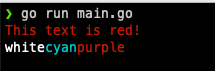

# golors

[](https://pkg.go.dev/github.com/a-poor/golors)

_created by Austin Poor_

A tiny go package for printing colorful text to the terminal.

Functions wrap `fmt.Print` and `fmt.Println` for the following colors:

* Red
* Green
* Yellow
* Blue
* Purple
* Cyan
* Gray
* Grey (alias of Gray)
* White

## Example

```go
package main

import "github.com/a-poor/golors"

func main() {
    // Print red text and a new-line character
    golors.Redln("This text is red!")
    
    // These three commands print a single line "whitecyanpurple"
    // but where each word is the correct color
    golors.White("white")
    golors.Cyan("cyan")
    golors.Purpleln("purple")
}
```

And the result is:



## ToDo

Include more colors, background colors, and text styles (_ie_ bold, faint, italics, and underlined)

[Reference article](https://dev.to/ifenna__/adding-colors-to-bash-scripts-48g4)


